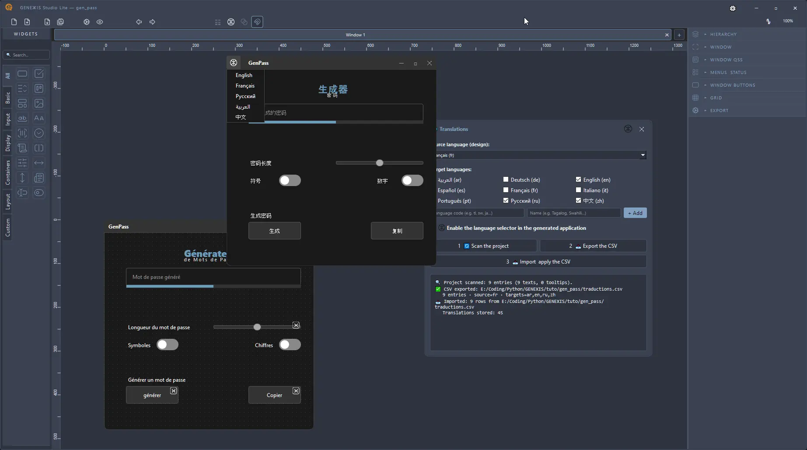

  

<h1 align="center">GENEⵣIS Studio</h1>

  <b>Design complete Python PyQt6 applications with this visual development studio.</b>

  
  
  

  <a href="https://github.com/nexx-dz/geneXis-studio/releases/download/v1.0.1/GeneXis_Studio_lite_Setup.exe"><b>⬇ Download GENEⵣIS Studio LITE 1.0.1</b> (Windows Setup, ~116 MB)</a>

---

## ✨ Why GENEⵣIS Studio ?

GENEⵣIS Studio is not a mere interface editor: it is a **complete visual development studio for Python PyQt6**. Draw windows, widgets and styles on the canvas, fine-tune every detail in the inspector (properties, QSS styles, translations, wiring), preview in one click, then **save your project and export the Python source code**. No-code is enough for basic apps — but this studio is a real IDE: export, code your logic, ship your application. And every widget **is** a plugin: an open architecture that grows with its creators.

## 🚀 LITE edition contents

- **Clean source code export**: generate ready-to-use Python PyQt6
- **Direct, working runtime preview** in one click
- **Signal wiring**: in code, smart mode or wire mode
- **Designer-grade canvas**: zoom, pan, advanced alignment tools
- **18 essential widgets**: buttons, inputs, lists, tables, tabs, sliders, gauges, pickers…
- **11 built-in themes** (dark, light, colorful)
- **9 interface languages** (FR, EN, AR, DE, ES, IT, PT, RU, ZH) + translation dock
- **Project saving**
- Per-element QSS, right in the inspector

## 🖼️ Preview

## 📦 LITE · DEMO · Full

| Feature | **LITE** (free) | **DEMO** (free) | **Full** |
|---|---|---|---|
| Price | Free | Free | Paid |
| Widgets (plugins) | 18 built-in | 30 built-in | 30 built-in (see plugin section) |
| Application themes | 11 | 11 | 11 |
| Interface languages | 9 | 9 | 9 |
| Designer canvas (zoom, pan) | ✓ | ✓ | ✓ |
| Advanced alignment tools | ✓ | ✓ | ✓ |
| Signal wiring (code / smart / wire) | ✓ | ✓ | ✓ |
| Translation dock | ✓ | ✓ | ✓ |
| Clean source code export | ✓ | — | ✓ |
| EXE export via Nuitka (if installed) | — | — | ✓ |
| Project saving | ✓ | — | ✓ |
| Runtime preview | Full | Protected (watermark) | Full |
| QSS (inspector, per element) | ✓ | ✓ | ✓ |
| QSS studio (window, assistant, snippets) | — | ✓ | ✓ |
| Built-in code editor | — | ✓ | ✓ |
| Layout explorer | — | ✓ | ✓ |
| Plugin manager | — | — | ✓ |
| Built-in canvas help | — | — | ✓ |

## 🧩 Plugins

Every GENEⵣIS Studio widget is a plugin. The plugin manager will allow the creator community to design and add new widgets, accessible directly from this tool.

- **LITE**: create freely, no time limit.
- **DEMO**: all widgets and tools to try out, without saving or exporting.
- **Full**: everything unlocked — 30 widgets, community plugins, saving, EXE export, support.

## 💻 System requirements

- **OS**: Windows 10 / 11 (64-bit)
- **Architecture**: x64
- **Storage**: ~350 MB free during installation (~116 MB installer + extracted application)
- **Optional**: Python 3.12+ (to use the exported source code directly), Nuitka (Full edition EXE export)

## 🗑️ Uninstall

1. Run the **Uninstall** shortcut created in the Start menu (or `Uninstall GENEXIS Studio LITE.exe` in the installation folder).
2. Follow the instructions. User-created projects are never touched by the uninstaller.

## 📜 Changelog

### v1.0.1 (2026-09-21)
- **EULA included** (FR + EN): the license agreement is now installed with the application (LICENCE.txt).
  Key point: anything created with the LITE edition belongs to you and may be commercialized if you credit « Created with GENEⵣIS Studio Lite ». The LITE edition itself may not be resold or embedded in a commercial product.
  Governing law: Swiss law.
- SHA256 checksum: `37FE98F41D97206803BA17C1E8D3CA8C6813D3972A169B6644E5FB98C05810CD`

### v1.0.0 (2026-09-10)
- First public LITE release: source code export, runtime preview, signal wiring, 18 widgets, 11 themes, 9 languages, project saving.

## 🔗 Links

- **Full version** → [NEXⵣ official site](https://nexx-studio.netlify.app)
- **YouTube channel** → [tutorials & demos](https://www.youtube.com/@nexx-dz)
- **LITE download** → [Release v1.0.1](https://github.com/nexx-dz/geneXis-studio/releases)

## 👥 Authors

© 2026 B.F. Nexⵣ-Studio - Holmes & Watson

---

  <b>NEXⵣ</b> · Innovation & Culture Digitale

---

  

<h1 align="center">GENEⵣIS Studio</h1>

  <b>Concevez vos applications Python PyQt6 complètes avec ce studio de développement visuel.</b>

  
  
  

  <a href="https://github.com/nexx-dz/geneXis-studio/releases/download/v1.0.1/GeneXis_Studio_lite_Setup.exe"><b>⬇ Télécharger GENEⵣIS Studio LITE 1.0.1</b> (Setup Windows, ~116 Mo)</a>

---

## ✨ Pourquoi GENEⵣIS Studio ?

GENEⵣIS Studio n'est pas un simple éditeur d'interfaces : c'est un **environnement de développement visuel complet pour Python PyQt6**. Dessinez vos fenêtres, widgets et styles sur le canvas, réglez chaque détail dans l'inspecteur (propriétés, styles QSS, traductions, câblage), prévisualisez en un clic, puis **sauvegardez votre projet et exportez le code source Python**. Le no-code suffit pour les applications basiques — mais ce studio est un vrai IDE : exportez, codez votre logique, finalisez votre application. Et chaque widget **est** un plugin : une architecture ouverte qui grandit avec ses créateurs.

## 🚀 Contenu de l'édition LITE

- **Export code source propre** : générez du Python PyQt6 directement exploitable
- **Aperçu d'exécution direct** et fonctionnel, en un clic
- **Câblage des signaux** : en code, en mode smart ou en mode filaire
- **Canvas de graphiste** : zoom, pan, outils d'alignement avancés
- **18 widgets essentiels** : boutons, champs, listes, tableaux, onglets, curseurs, jauges, sélecteurs…
- **11 thèmes** prêts à l'emploi (sombres, clairs, colorés)
- **9 langues d'interface** (FR, EN, AR, DE, ES, IT, PT, RU, ZH) + dock de traduction
- **Sauvegarde des projets**
- QSS par élément, directement dans l'inspecteur

## 🖼️ Aperçu

## 📦 LITE · DEMO · Complète

| Fonctionnalité | **LITE** (gratuit) | **DEMO** (gratuit) | **Complète** |
|---|---|---|---|
| Prix | Gratuit | Gratuit | Payant |
| Widgets (plugins) | 18 intégrés | 30 intégrés | 30 intégrés (voir la section plugin) |
| Thèmes d'application | 11 | 11 | 11 |
| Langues d'interface | 9 | 9 | 9 |
| Canvas graphiste (zoom, pan) | ✓ | ✓ | ✓ |
| Outils d'alignement avancés | ✓ | ✓ | ✓ |
| Câblage signaux (code / smart / filaire) | ✓ | ✓ | ✓ |
| Dock de traduction | ✓ | ✓ | ✓ |
| Export code source propre | ✓ | — | ✓ |
| Export EXE via Nuitka (si installé) | — | — | ✓ |
| Sauvegarde des projets | ✓ | — | ✓ |
| Aperçu d'exécution | Complet | Protégé (filigrane) | Complet |
| QSS (inspecteur, par élément) | ✓ | ✓ | ✓ |
| Studio QSS (fenêtre, assistant, snippets) | — | ✓ | ✓ |
| Éditeur de code intégré | — | ✓ | ✓ |
| Explorateur de layouts | — | ✓ | ✓ |
| Gestionnaire de plugins | — | — | ✓ |
| Aide canvas intégrée | — | — | ✓ |

## 🧩 Plugins

Chaque widget de GENEⵣIS Studio est un plugin. Le gestionnaire de plugins permettra à la communauté des créateurs de concevoir et d'ajouter de nouveaux widgets, accessibles directement depuis cet outil.

- **LITE** : pour découvrir et créer librement, sans limite de temps.
- **DEMO** : tous les widgets et outils à tester, sans sauvegarde ni export.
- **Complète** : tout débloqué — 30 widgets, plugins communauté, sauvegarde, export EXE, support.

## 💻 Configuration requise

- **Système** : Windows 10 / 11 (64 bits)
- **Architecture** : x64
- **Stockage** : ~350 Mo libres pendant l'installation (~116 Mo l'installeur + application déployée)
- **Optionnel** : Python 3.12+ (pour exploiter le code source exporté), Nuitka (export EXE de l'édition Complète)

## 🗑️ Désinstallation

1. Lancez le raccourci **Désinstaller** créé dans le menu Démarrer (ou `Uninstall GENEXIS Studio LITE.exe` dans le dossier d'installation).
2. Suivez les instructions. Les projets créés par l'utilisateur ne sont jamais touchés par le désinstalleur.

## 📜 Changelog

### v1.0.1 (2026-09-21)
- **EULA inclus (FR + EN)** : le contrat de licence est désormais installé avec l'application (LICENCE.txt).
  Point clé : tout ce qui est créé avec l'édition LITE vous appartient et peut être commercialisé à condition de citer « Créé avec GENEⵣIS Studio Lite ». L'édition LITE elle-même ne peut pas être revendue ni incluse dans un produit commercial.
  Droit applicable : droit suisse.
- Checksum SHA256 : `37FE98F41D97206803BA17C1E8D3CA8C6813D3972A169B6644E5FB98C05810CD`

### v1.0.0 (2026-09-10)
- Première release LITE publique : export du code source, aperçu d'exécution, câblage des signaux, 18 widgets, 11 thèmes, 9 langues, sauvegarde des projets.

## 🔗 Liens

- **Version complète** → [Site officiel NEXⵣ](https://nexx-studio.netlify.app)
- **Chaîne YouTube** → [tutoriels & démos](https://www.youtube.com/@nexx-dz)
- **Téléchargement LITE** → [Release v1.0.1](https://github.com/nexx-dz/geneXis-studio/releases)

## 👥 Auteurs

© 2026 B.F. Nexⵣ-Studio - Holmes & Watson

---

  <b>NEXⵣ</b> · Innovation & Culture Digitale

